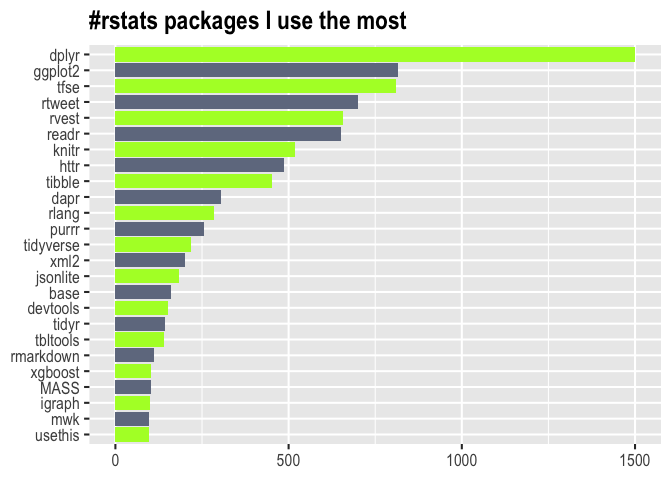

<!-- README.md is generated from README.Rmd. Please edit that file -->

# pkguse

<!-- badges: start -->

<!-- badges: end -->

The goal of pkguse is to help users take inventory of their most used
packages

## Installation

You can install the dev version of pkguse from
[Github](https://github.com/mkearney/pkguse) with:

``` r
remotes::install_github("mkearney/pkguse")
```

## Example

This is a basic use example:

``` r
## load {pkguse}
library(pkguse)

## supply dir locations
p <- pkg_use(c("~/Documents", "~/Dropbox", "~/R"))

## view freq table [tibble] output
print(p, n = 25)
#> # A tibble: 350 x 2
#>    pkg           n
#>    <fct>     <int>
#>  1 dplyr      1501
#>  2 ggplot2     817
#>  3 tfse        810
#>  4 rtweet      699
#>  5 rvest       656
#>  6 readr       652
#>  7 knitr       518
#>  8 httr        486
#>  9 tibble      453
#> 10 dapr        305
#> 11 rlang       284
#> 12 purrr       255
#> 13 tidyverse   218
#> 14 xml2        201
#> 15 jsonlite    184
#> 16 base        160
#> 17 devtools    151
#> 18 tidyr       143
#> 19 tbltools    140
#> 20 rmarkdown   112
#> 21 xgboost     103
#> 22 MASS        102
#> 23 igraph      101
#> 24 mwk          98
#> 25 usethis      96
#> # … with 325 more rows
```

The output has methods for `plot`

``` r
## plot pkguse (top 25)
plot(p, n = 25)
```



and `summary`

``` r
summary(p)
#> Total packages        : 350
#> Total uses            : 12922
#> Most used package     : dplyr (1501 times)
#> Median used package   : vctrs (4 times)
```
